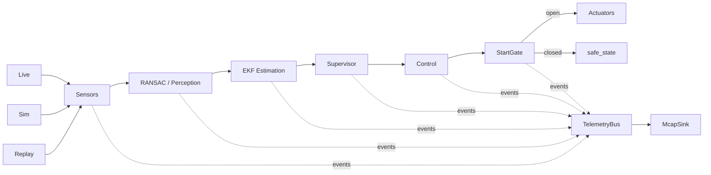

# NeverFastEnough

NeverFastEnough is a Nix-managed autonomous RC car stack for a Raspberry Pi 5
(`aarch64-linux`) with live hardware control, deterministic simulation, MCAP
recording/replay, a shared runtime pipeline, and a StartGate arming layer that
prevents actuator writes until the operator explicitly arms the car.

## Overview

The runtime is intentionally split between pure algorithm crates, runtime
orchestration, simulation, and a thin hardware/binary crate. Sensor data comes
from live hardware, simulation, or MCAP input replay; every mode feeds the same
perception, estimation, supervisor, and control pipeline; telemetry is published
as a side channel to a bus and can be recorded to MCAP.



## Workspace layout

```text
packages/
  nfe-core             shared types, I/O traits, telemetry events
  nfe-tunable-derive  proc macro for Tunable derive
  nfe-algo            pure algorithm code: perception, estimation, control, supervisor
  nfe-runtime         pipeline orchestration, TelemetryBus, McapSink, StartGate, mode wiring
  nfe-sim             simulation crate: world model, vehicle dynamics, sensor synthesis, noise
  nfe-car             thin wiring crate, produces all binaries
```

### Layering and dependency graph

| Crate                | Role                                                                                                                                                                          | Depends on                                                   |
| -------------------- | ----------------------------------------------------------------------------------------------------------------------------------------------------------------------------- | ------------------------------------------------------------ |
| `nfe-tunable-derive` | Procedural macro for deriving the tunable parameter registry                                                                                                                  | proc-macro dependencies only                                 |
| `nfe-core`           | Shared domain types, `SensorSource`/`ActuatorSink` traits, telemetry event taxonomy, tunable parameter traits                                                                 | `nfe-tunable-derive`                                         |
| `nfe-algo`           | Pure algorithm implementation: RANSAC/corridor perception, EKF/dead-reckon estimation, localization, mapping, supervisor, LQR/PID/speed/reactive control, raceline components | `nfe-core`                                                   |
| `nfe-sim`            | Deterministic simulation source, world model, vehicle dynamics, synthetic sensors, noise                                                                                      | `nfe-core` only                                              |
| `nfe-runtime`        | `Pipeline::step`, `TelemetryBus`, MCAP input replay, `McapSink`, StartGate, runtime tuning helpers, mapping worker/session glue                                               | `nfe-core`, `nfe-algo`                                       |
| `nfe-car`            | Hardware adapters, config/CLI parsing, system mode dispatch, diagnostics, tuning binary, arming helper                                                                        | `nfe-core`, `nfe-runtime`, `nfe-sim`, hardware/system crates |

`nfe-algo` is kept pure so the control algorithms can be tested
deterministically and reused in simulation, replay, and future map-based modes
without hardware, sockets, MCAP, systemd, or telemetry publishing side effects.
Telemetry construction/publishing lives in runtime orchestration and simulation
helpers, not in the algorithms.

## Binaries

All binaries are produced by `packages/nfe-car`.

### `car`

`car` is the main runtime binary. It supports live, simulation, and input replay
modes. Live mode is selected when neither `--sim` nor `--replay` is present;
`--live` may be used as an operator-visible no-op mode marker because unknown
flags are ignored by the current parser.

```bash
car --live --record /tmp/run.mcap
car --sim worlds/track.json --record /tmp/sim.mcap --sim-seed 42
car --replay /tmp/run.mcap --record /tmp/reprocessed.mcap --fast
```

Common options:

| Option                                                          | Meaning                                                                                               |
| --------------------------------------------------------------- | ----------------------------------------------------------------------------------------------------- | ------------ | ------------------------------ |
| `--config <path>`                                               | Load car TOML config, otherwise defaults are used                                                     |
| `--record <path>`                                               | Record runtime telemetry to MCAP through `TelemetryBus` and `McapSink`                                |
| `--sim <world.json>`                                            | Run deterministic simulator input mode                                                                |
| `--replay <file.mcap>`                                          | Run MCAP sensor input replay mode                                                                     |
| `--fast`                                                        | Accepted for replay compatibility; runtime input replay is deterministic and does not wall-clock pace |
| `--model <kinematic                                             | dynamic                                                                                               | identified>` | Select simulator vehicle model |
| `--model-params <json>`                                         | Parameters for the `identified` simulator model                                                       |
| `--sim-seed <u64>`                                              | Deterministic simulator noise seed                                                                    |
| `--cost-out <path>`                                             | Write post-run cost summary JSON                                                                      |
| `--csv-out <path>`                                              | Write per-tick metrics CSV                                                                            |
| `--force-arm`                                                   | Force StartGate open in sim/replay; guarded in live mode                                              |
| `--i-understand-live-force-arm`                                 | Required with `--force-arm` in live mode                                                              |
| `--arm-bind <ip>` / `--arm-port <port>` / `--arm-token <token>` | Override live UDP StartGate listener settings                                                         |
| `--gpio-arm` / `--gpio-pin <pin>`                               | Opt in to GPIO StartGate arming for live mode                                                         |

### `car-tune`

`car-tune` runs CMA-ES over the `Tunable` registry and evaluates candidates
through `nfe-runtime::Pipeline::step`, not through a hand-mirrored tuning
struct.

```bash
car-tune --sim worlds/track.json --out best_runtime_config.json --generations 200 --episode-s 30 --sim-seed 42
car-tune --replay /tmp/run.mcap --out best_runtime_config.json --generations 80 --episode-s 20
car-tune --live --out best_runtime_config.json --generations 10 --episode-s 5
```

Options:

| Option                                         | Meaning                                                                              |
| ---------------------------------------------- | ------------------------------------------------------------------------------------ | ------------ | ------------------------------------ |
| `--sim <world.json>` or `--world <world.json>` | Evaluate candidates against simulator snapshots; defaults to `track.json` if omitted |
| `--replay <file.mcap>`                         | Evaluate candidates against recorded MCAP sensor input                               |
| `--live`                                       | Sensor-only live dry-run evaluation; non-deterministic and intended for diagnostics  |
| `--out <path>`                                 | Output tuned runtime config; default `best_runtime_config.json`                      |
| `--config <path>`                              | Base `RuntimeConfig` TOML; defaults to runtime defaults                              |
| `--generations <n>`                            | CMA-ES generation limit; default `200`                                               |
| `--episode-s <seconds>`                        | Episode duration cap; default `30.0`                                                 |
| `--model <kinematic                            | dynamic                                                                              | identified>` | Simulator model; default `kinematic` |
| `--model-params <json>`                        | Required when `--model identified`                                                   |
| `--sim-seed <u64>`                             | Deterministic simulator seed                                                         |
| `--sigma <f64>`                                | CMA-ES initial sigma; default `0.3`                                                  |

The output `best_runtime_config.json` is a serialized `RuntimeConfig` containing
the best candidate found by the search. It can be inspected directly, used as a
base config for further tuning, or converted into the runtime configuration path
used by the car.

### `nfe-arm`

`nfe-arm` is the companion operator CLI for sending UDP arm/disarm messages to a
running `car` process.

```bash
nfe-arm --arm --host nfe.local --port 4578 --token nfe
nfe-arm --disarm --host nfe.local --port 4578 --token nfe
```

Defaults are `--host 127.0.0.1`, `--port 4578`, and `--token nfe`. The UDP
payload is exactly `NFE_ARM <token> arm` or `NFE_ARM <token> disarm`.

### `car-diag`

`car-diag` is the Raspberry Pi hardware diagnostic binary. Based on the
codebase, it verifies IMU over I2C, RPLiDAR over `/dev/lidar`, HC-SR04 sonar
GPIO pairs, and combined sensor readiness; this description should be
re-verified against hardware wiring before race-day use.

```bash
car-diag imu
car-diag imu --once
car-diag lidar
car-diag lidar --once
car-diag sonar
car-diag sonar --once
car-diag all
```

Exit code `0` means checked sensors passed; exit code `1` means one or more
checked sensors failed or timed out.

## Operating modes

### Live mode

Live mode reads sensors from the Raspberry Pi hardware state, runs the runtime
pipeline, publishes telemetry, and writes actuator commands only after StartGate
and safety checks allow it.

```bash
car --live --record /tmp/live.mcap
# Equivalent with the current parser:
car --record /tmp/live.mcap
```

Live mode initializes sensor threads, waits for readiness, notifies systemd
readiness on Linux, binds the UDP arm listener before IMU calibration, and then
starts the loop.

### Simulation mode

Simulation mode loads a world file, synthesizes sensor snapshots through
`nfe-sim`, runs the same runtime pipeline, and records world/ground-truth
telemetry in addition to sensor/control topics.

```bash
car --sim worlds/track.json --model kinematic --sim-seed 42 --record /tmp/sim.mcap
car --sim worlds/track.json --model dynamic --record /tmp/sim.mcap
car --sim worlds/track.json --model identified --model-params identified.json --record /tmp/sim.mcap
```

Sim mode is deterministic when `--sim-seed` is provided. StartGate defaults to a
delay policy in sim mode and still suppresses actuator output until the gate
opens.

### Replay mode

Replay mode reads MCAP sensor topics, reconstructs `SensorSnapshot` input, and
runs the same runtime pipeline. It is input replay, not output replay: recorded
`/sensor/*` input is fed back through `Pipeline::step`.

```bash
car --replay /tmp/live.mcap --record /tmp/replay-output.mcap --fast
```

Replay timing is deterministic and based on recorded MCAP timestamps; it does
not depend on wall-clock pacing.

## Start gate

StartGate is the final runtime gate before actuator writes. The pipeline still
runs while the gate is closed, telemetry still publishes, and the actuator sink
receives `safe_state()` instead of throttle/steering commands. Supervisor,
ESTOP, watchdog, and non-finite command checks remain independent of StartGate.

### UDP arming procedure

Live mode defaults to UDP arming. The listener defaults to:

```toml
[start_gate]
udp_bind = "0.0.0.0"
udp_port = 4578
udp_token = "nfe"
```

Race-day operator command over SSH:

```bash
ssh localhost@nfe.local 'nfe-arm --arm --host 127.0.0.1 --port 4578 --token nfe'
```

Emergency/manual disarm over SSH:

```bash
ssh localhost@nfe.local 'nfe-arm --disarm --host 127.0.0.1 --port 4578 --token nfe'
```

If sending from the operator laptop without SSH and UDP routing/firewalling
allows it:

```bash
nfe-arm --arm --host nfe.local --port 4578 --token nfe
```

### GPIO arming for race day

GPIO arming is opt-in and can run alongside UDP. UDP remains the default live
trigger.

Config:

```toml
[start_gate]
gpio_enabled = true
gpio_pin = 17
```

CLI override:

```bash
car --live --gpio-arm --gpio-pin 17
```

Implementation details: the GPIO source uses `rppal::gpio`, configures the
selected BCM pin as input with pull-up, registers `Trigger::Both` edge
interrupts, polls non-blockingly once per control-loop tick, and applies a 50 ms
debounce through rppal. Falling edge maps to `Arm`; rising edge maps to
`Disarm`. When UDP and GPIO are both enabled, the first non-empty signal
observed in a tick wins; UDP is polled before GPIO.

### Force-arm guardrail

`--force-arm` is allowed in sim/replay. In live mode it is rejected unless
paired with:

```bash
--i-understand-live-force-arm
```

This guardrail prevents accidentally bypassing the operator arming procedure on
hardware.

## Running on hardware

The target hardware platform is Raspberry Pi 5 on `aarch64-linux`. OS and
service configuration live under `hosts/nfe/configuration.nix` and the car
service uses the Nix package `pkgs.nfe-car`.

Build/deploy flow:

```bash
# Evaluate flake outputs without building
nix flake check --no-build

# Build the aarch64 package; requires an aarch64-capable builder from non-Linux/non-aarch64 hosts
nix build .#packages.aarch64-linux.nfe-car

# Deploy the NixOS system to the Pi
deploy .#nfe
```

On the Pi:

```bash
systemctl status car
systemctl restart car
journalctl -u car -f
car-diag all
```

Typical race-day flow:

```bash
# Deploy or restart the service
ssh localhost@nfe.local 'sudo systemctl restart car && journalctl -u car -n 50 --no-pager'

# Verify sensors if needed
ssh localhost@nfe.local 'car-diag all'

# Arm once the car is staged
ssh localhost@nfe.local 'nfe-arm --arm --host 127.0.0.1 --port 4578 --token nfe'

# Disarm if needed
ssh localhost@nfe.local 'nfe-arm --disarm --host 127.0.0.1 --port 4578 --token nfe'
```

## Tuning

`car-tune` gets its search space from the runtime/algo `Tunable` registry and
evaluates every candidate through `Pipeline::step`.

Simulation episode tuning:

```bash
car-tune --sim worlds/track.json --sim-seed 42 --episode-s 30 --generations 200 --out best_runtime_config.json
```

Replay episode tuning:

```bash
car-tune --replay /tmp/live.mcap --episode-s 30 --generations 100 --out best_runtime_config.json
```

Live dry-run tuning:

```bash
car-tune --live --episode-s 5 --generations 10 --out best_runtime_config.json
```

Simulation is the preferred deterministic tuning path. Replay evaluates against
fixed recorded sensor input. Live tuning is sensor-only/dry-run and
non-deterministic because each candidate observes current hardware state rather
than the same episode.

`best_runtime_config.json` contains a pretty-printed serialized `RuntimeConfig`
produced by applying the best CMA-ES vector through `config_from_vector`;
integer parameters are rounded/clamped by the tunable registry when
materialized.

## Telemetry and visualization

Runtime telemetry is published to `TelemetryBus`. MCAP recording is a bus
subscriber via `McapSink`; there is no parallel recorder path. Heavy
visualization topics use Foxglove-compatible protobuf schemas, while lower-rate
semantic/control topics use JSON.

Record MCAP:

```bash
car --live --record /tmp/live.mcap
car --sim worlds/track.json --record /tmp/sim.mcap
car --replay /tmp/live.mcap --record /tmp/replay-output.mcap
```

Open recordings in Foxglove Studio by opening the `.mcap` file directly.
Protobuf topics use Foxglove-native schemas where available, so point clouds,
poses, and wall scenes render without a custom plugin.

| Topic                               | Encoding | Schema / payload                       |
| ----------------------------------- | -------- | -------------------------------------- |
| `/sensor/imu`                       | JSON     | IMU sample telemetry                   |
| `/sensor/lidar`                     | protobuf | `foxglove.PointCloud`                  |
| `/sensor/sonar`                     | JSON     | Sonar telemetry                        |
| `/control/command`                  | JSON     | Control command telemetry              |
| `/control/metrics`                  | JSON     | Runtime loop/cost metrics              |
| `/control/safety`                   | JSON     | Safety telemetry                       |
| `/control/start_gate`               | JSON     | StartGate transition telemetry         |
| `/perception/reactive/corridor`     | JSON     | Reactive corridor estimate             |
| `/perception/reactive/ransac_walls` | JSON     | Reactive RANSAC wall telemetry         |
| `/mapping/ransac_walls`             | JSON     | Mapping wall detections                |
| `/estimation/ekf/state`             | JSON     | EKF state telemetry                    |
| `/estimation/ekf/pose`              | protobuf | `foxglove.PosesInFrame`                |
| `/estimation/ekf/bias`              | JSON     | EKF bias telemetry                     |
| `/estimation/ekf/covariance`        | JSON     | EKF covariance telemetry               |
| `/mapping/global_map_delta`         | JSON     | Global map delta telemetry             |
| `/mapping/global_map_snapshot`      | JSON     | Global map snapshot telemetry          |
| `/mapping/status`                   | JSON     | Mapping status telemetry               |
| `/mapping/loop_closure`             | JSON     | Loop-closure telemetry                 |
| `/race/start_line`                  | JSON     | Start-line telemetry                   |
| `/race/lap`                         | JSON     | Lap telemetry                          |
| `/planning/raceline`                | JSON     | Raceline planning telemetry            |
| `/planning/race_reference`          | JSON     | Race reference telemetry               |
| `/supervisor/state`                 | JSON     | Supervisor state telemetry             |
| `/supervisor/transition`            | JSON     | Supervisor transition telemetry        |
| `/localization/scan_match`          | JSON     | Scan-match localization telemetry      |
| `/localization/particle_filter`     | JSON     | Particle-filter localization telemetry |
| `/localization/result`              | JSON     | Localization result telemetry          |
| `/world/snapshot`                   | JSON     | Simulation world snapshot              |
| `/world/walls`                      | protobuf | `foxglove.SceneUpdate`                 |
| `/sim/ground_truth/state`           | JSON     | Simulator ground-truth state           |
| `/sim/ground_truth/pose`            | protobuf | `foxglove.PosesInFrame`                |

## Development

Build the workspace:

```bash
cargo build --workspace
```

Run tests:

```bash
cargo test --workspace
```

Run lint as CI-equivalent validation:

```bash
cargo clippy --workspace --all-targets -- -D warnings
```

Build the Nix package:

```bash
nix build .#packages.aarch64-linux.nfe-car
```

From non-`aarch64-linux` hosts, Nix needs an `aarch64-linux` remote builder or
equivalent cross-compilation setup. The package builds from the workspace root
so path dependencies, the `nfe-tunable-derive` proc macro, and `nfe-runtime`'s
`prost-build` step are visible; `protobuf` is included as a native build input
for `protoc`.

Useful checks:

```bash
nix flake check --no-build
nix eval .#packages.aarch64-linux.nfe-car.pname
cargo metadata --no-deps --format-version 1
```

## Known limitations

- CMA-ES currently treats integer parameters as continuous during
  covariance/adaptation and relies on the tunable registry to round/clamp
  materialized configs.
- Log-scale parameter metadata is discovered but candidates are not yet sampled
  in log space; the current objective clamps in linear space.
- Live tuning is non-deterministic and sensor-only/dry-run, so sim or replay
  tuning should be preferred for repeatable optimization.
- Building `.#packages.aarch64-linux.nfe-car` from the current development host
  requires a reachable `aarch64-linux` Nix builder; without one, Nix evaluation
  can pass while the actual build is blocked by platform mismatch or remote
  builder connectivity.
- The old live Foxglove bridge was removed during telemetry consolidation and
  has not been reimplemented against `TelemetryBus`; MCAP files can still be
  opened in Foxglove.
