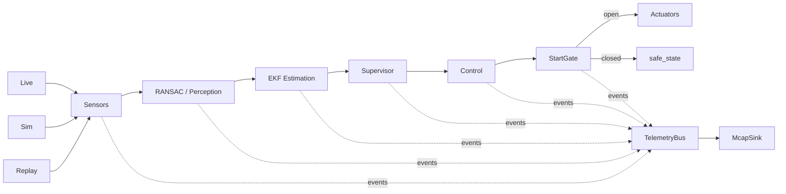

# NeverFastEnough

NeverFastEnough is a Nix-managed autonomous RC car stack for a Raspberry Pi 5
(`aarch64-linux`) with live hardware control, deterministic simulation, MCAP
recording/replay, a shared runtime pipeline, and a StartGate arming layer that
prevents actuator writes until the operator explicitly arms the car.

## Overview

The runtime is intentionally split between pure algorithm crates, runtime
orchestration, simulation, and a thin hardware/binary crate. Sensor data comes
from live hardware, simulation, or MCAP input replay; every mode feeds the same
perception, estimation, supervisor, and control pipeline; telemetry is published
as a side channel to a bus and can be recorded to MCAP.



## Workspace layout

```text
packages/
  nfe-core             shared types, I/O traits, telemetry events
  nfe-tunable-derive  proc macro for Tunable derive
  nfe-algo            pure algorithm code: perception, estimation, control, supervisor
  nfe-runtime         pipeline orchestration, TelemetryBus, McapSink, StartGate, mode wiring
  nfe-sim             simulation crate: world model, vehicle dynamics, sensor synthesis, noise
  nfe-tuner           optimizer-independent search space, candidates, scores, and sim evaluation
  nfe-car             thin wiring crate, produces all binaries
```

### Layering and dependency graph

| Crate                | Role                                                                                                                                                                          | Depends on                                                   |
| -------------------- | ----------------------------------------------------------------------------------------------------------------------------------------------------------------------------- | ------------------------------------------------------------ |
| `nfe-tunable-derive` | Procedural macro for deriving the tunable parameter registry                                                                                                                  | proc-macro dependencies only                                 |
| `nfe-core`           | Shared domain types, `SensorSource`/`ActuatorSink` traits, telemetry event taxonomy, tunable parameter traits                                                                 | `nfe-tunable-derive`                                         |
| `nfe-algo`           | Pure algorithm implementation: RANSAC/corridor perception, EKF estimation, localization, mapping, supervisor, LQR/PID/speed/reactive control, raceline components | `nfe-core`                                                   |
| `nfe-sim`            | Deterministic simulation source, world model, vehicle dynamics, synthetic sensors, noise                                                                                      | `nfe-core` only                                              |
| `nfe-runtime`        | `Pipeline::step`, `TelemetryBus`, MCAP input replay, `McapSink`, StartGate, runtime tuning helpers, mapping/raceline worker and session glue                                   | `nfe-core`, `nfe-algo`                                       |
| `nfe-tuner`          | Optimizer-independent tuning search-space JSON, flat candidate application, candidate scores, and sim lap evaluation                                                          | `nfe-core`, `nfe-runtime`, `nfe-sim`                         |
| `nfe-car`            | Hardware adapters, config/CLI parsing, system mode dispatch, diagnostics, tuning binary, arming helper                                                                        | `nfe-core`, `nfe-runtime`, `nfe-sim`, `nfe-tuner`, hardware/system crates |

`nfe-algo` is kept pure so the control algorithms can be tested
deterministically and reused in simulation, replay, and future map-based modes
without hardware, sockets, MCAP, systemd, or telemetry publishing side effects.
Telemetry construction/publishing lives in runtime orchestration and simulation
helpers, not in the algorithms.

## Binaries

All binaries are produced by `packages/nfe-car`.

### `car`

`car` is the main runtime binary. It supports live, simulation, and input replay
modes. Live mode is selected when neither `--sim` nor `--replay` is present;
`--live` may be used as an operator-visible no-op mode marker because unknown
flags are ignored by the current parser.

```bash
car --live --record /tmp/run.mcap
car --sim worlds/track.json --record /tmp/sim.mcap --sim-seed 42
car --replay /tmp/run.mcap --record /tmp/reprocessed.mcap --fast
```

Common options:

| Option                                                          | Meaning                                                                                               |
| --------------------------------------------------------------- | ----------------------------------------------------------------------------------------------------- | ------------ | ------------------------------ |
| `--config <path>`                                               | Load car TOML config, otherwise defaults are used                                                     |
| `--record <path>`                                               | Record runtime telemetry to MCAP through `TelemetryBus` and `McapSink`                                |
| `--sim <world.json>`                                            | Run deterministic simulator input mode                                                                |
| `--replay <file.mcap>`                                          | Run MCAP sensor input replay mode                                                                     |
| `--fast`                                                        | Accepted for replay compatibility; runtime input replay is deterministic and does not wall-clock pace |
| `--model <kinematic                                             | dynamic                                                                                               | identified>` | Select simulator vehicle model |
| `--model-params <json>`                                         | Parameters for the `identified` simulator model                                                       |
| `--sim-seed <u64>`                                              | Deterministic simulator noise seed                                                                    |
| `--cost-out <path>`                                             | Write post-run cost summary JSON                                                                      |
| `--csv-out <path>`                                              | Write per-tick metrics CSV                                                                            |
| `--force-arm`                                                   | Force StartGate open in sim/replay; guarded in live mode                                              |
| `--i-understand-live-force-arm`                                 | Required with `--force-arm` in live mode                                                              |
| `--arm-bind <ip>` / `--arm-port <port>` / `--arm-token <token>` | Override live UDP StartGate listener settings                                                         |
| `--gpio-arm` / `--gpio-pin <pin>`                               | Opt in to GPIO StartGate arming for live mode                                                         |

### `car-tune`

`car-tune` runs CMA-ES over the `Tunable` registry and evaluates candidates
through `nfe-runtime::Pipeline::step`, not through a hand-mirrored tuning
struct.

```bash
car-tune --sim worlds/track.json --out best_runtime_config.json --generations 200 --episode-s 90 --target-laps 3 --target-speed 3.0 --eval-seeds 3 --sim-seed 42 --parallel --progress
car-tune --dump-search-space --param-prefix algo.apex --out search_space.json
car-tune --sim worlds/track.json --config packages/nfe-car/nfe.toml --candidate candidate.json --score-out score.json
car-tune --replay /tmp/run.mcap --out best_runtime_config.json --generations 80 --episode-s 20 --parallel --progress
car-tune --live --out best_runtime_config.json --generations 10 --episode-s 5 --progress
```

Options:

| Option                                         | Meaning                                                                              |
| ---------------------------------------------- | ------------------------------------------------------------------------------------ |
| `--sim <world.json>` or `--world <world.json>` | Evaluate candidates against simulator snapshots; defaults to `track.json` if omitted |
| `--replay <file.mcap>`                         | Evaluate candidates against recorded MCAP sensor input                               |
| `--live`                                       | Sensor-only live dry-run evaluation; non-deterministic and intended for diagnostics  |
| `--out <path>`                                 | Output tuned runtime config; default `best_runtime_config.json`                      |
| `--config <path>`                              | Base car `nfe.toml` or `RuntimeConfig` TOML; defaults to runtime defaults            |
| `--generations <n>`                            | CMA-ES generation limit; default `200`                                               |
| `--episode-s <seconds>`                        | Episode duration cap; default `30.0`                                                 |
| `--model <kinematic|dynamic|identified>`       | Simulator model; default `kinematic`                                                 |
| `--model-params <json>`                        | Required when `--model identified`                                                   |
| `--sim-seed <u64>`                             | Base deterministic simulator seed                                                    |
| `--target-laps <n>`                            | Sim objective lap-completion target; default `3`                                     |
| `--target-speed <m/s>`                         | Sim objective reference speed for completed-lap scoring; default `3.0`               |
| `--min-avg-speed <m/s>`                        | Sim objective minimum average speed for incomplete episodes; default `1.0`           |
| `--eval-seeds <n>`                             | Number of deterministic sim seeds per candidate; default `1`                         |
| `--robustness-weight <w>`                      | Add `w * stddev(cost)` across sim seeds; default `0.0`                               |
| `--sigma <f64>`                                | CMA-ES initial sigma; default `0.3`                                                  |
| `--parallel`                                   | Evaluate CMA-ES candidates in parallel for sim/replay only; ignored for live mode    |
| `--progress`                                   | Print one progress line per generation                                               |
| `--dump-search-space`                          | Write JSON `SearchSpaceEntry[]` to `--out` and exit                                  |
| `--param-prefix <prefix>`                      | Restrict search-space entries; can be repeated, e.g. `algo.apex` and `algo.reactive` |
| `--candidate <path>`                           | Evaluate one flat candidate JSON instead of running CMA-ES                           |
| `--score-out <path>`                           | Write the single-candidate `CandidateScore` JSON                                     |

The output `best_runtime_config.json` is a serialized `RuntimeConfig` containing
the best candidate found by the search. It can be inspected directly, used as a
base config for further tuning, or converted into the runtime configuration path
used by the car.

### `nfe-arm`

`nfe-arm` is the companion operator CLI for sending UDP arm/disarm messages to a
running `car` process.

```bash
nfe-arm --arm --host nfe.local --port 4578 --token nfe
nfe-arm --disarm --host nfe.local --port 4578 --token nfe
```

Defaults are `--host 127.0.0.1`, `--port 4578`, and `--token nfe`. The UDP
payload is exactly `NFE_ARM <token> arm` or `NFE_ARM <token> disarm`.

### `car-raceline`

`car-raceline` is an offline Foxglove preview helper that loads a simulator world from `worlds/tracks/*.json`, converts its walls into a `TrackMap` with both legacy wall boundaries and a rasterized occupancy grid, runs `nfe-algo`'s occupancy-first raceline solver, and writes an MCAP containing the same scene topics used by runtime recordings: `/mapping/global_map_scene` and `/planning/raceline_scene`.

```bash
car-raceline worlds/tracks/minispa.json --out /tmp/minispa-raceline.mcap
car-raceline worlds/tracks/minispa.json --frame world --out /tmp/minispa-raceline-world.mcap
```

Open the output MCAP in Foxglove to inspect the wall scene and solver output. The helper defaults to the start-pose frame for convenient vehicle-relative viewing; `--frame world` exercises the same wall-to-occupancy rasterization and occupancy-first solver path in world coordinates. Raceline speeds come from the offline forward/backward velocity-profile limits configured under `[algo.raceline_solver]`.

### `car-bench`

`car-bench` runs open-loop dynamics identification scripts for the raceline controller. Sim modes run against `nfe-sim`; live modes command the real car on the ground and write CSV samples plus an optional JSON summary. Live modes are intentionally conservative starting points and require an explicit acknowledgement flag.

```bash
car-bench sim-throttle-step --config packages/nfe-car/nfe.toml --csv /tmp/throttle.csv --json /tmp/throttle.json
car-bench sim-coastdown --config packages/nfe-car/nfe.toml --csv /tmp/coast.csv
car-bench sim-steering-sweep --config packages/nfe-car/nfe.toml --csv /tmp/steer.csv

car-bench live-throttle-step --config packages/nfe-car/nfe.toml --csv /tmp/live-throttle.csv --i-understand-open-loop-driving
car-bench live-coastdown --config packages/nfe-car/nfe.toml --csv /tmp/live-coast.csv --i-understand-open-loop-driving
car-bench live-steering-sweep --config packages/nfe-car/nfe.toml --csv /tmp/live-steer.csv --i-understand-open-loop-driving
```

The default live limits (`--duration-s 4`, `--max-speed-ms 1`, `--max-throttle 0.12`, `--max-steering-rad 0.15`, `--max-yaw-rate-rad-s 2`) are conservative guesses, not validated vehicle limits. Keep them conservative through first live runs and relax only after abort handling, safe-state behavior, and the operator kill path are verified on the actual car.

### `car-diag`

`car-diag` is the Raspberry Pi hardware diagnostic binary. Based on the
codebase, it verifies IMU over I2C, RPLiDAR over `/dev/lidar`, HC-SR04 sonar
GPIO pairs, and combined sensor readiness; this description should be
re-verified against hardware wiring before race-day use.

```bash
car-diag imu
car-diag imu --once
car-diag lidar
car-diag lidar --once
car-diag sonar
car-diag sonar --once
car-diag all
```

Exit code `0` means checked sensors passed; exit code `1` means one or more
checked sensors failed or timed out.

## Operating modes

### Live mode

Live mode reads sensors from the Raspberry Pi hardware state, runs the runtime
pipeline, publishes telemetry, and writes actuator commands only after StartGate
and safety checks allow it.

```bash
car --live --record /tmp/live.mcap
# Equivalent with the current parser:
car --record /tmp/live.mcap
```

Live mode initializes sensor threads, waits for readiness, notifies systemd
readiness on Linux, binds the UDP arm listener before IMU calibration, and then
starts the loop.

### Live configuration

The NixOS `car.service` runs `car --config ${pkgs.nfe-car}/share/nfe-car/nfe.toml`, and the package installs `packages/nfe-car/nfe.toml` at that path. Changes to `packages/nfe-car/nfe.toml` therefore apply to live mode after rebuilding/deploying the package and restarting the service; the running process does not hot-reload the file.

Live mode maps `[control.perception]`, `[control.perception.ransac]`, and `[control.perception.apex]` into the runtime perception stack, `[control.stanley]` into the reactive Stanley controller, and `[mapping]` into the bounded runtime occupancy-mapping worker (`enabled`, `queue_capacity`). Runtime SLAM constants that are not part of the legacy control table live in `[algo.mapper]`, `[algo.correlative]`, and `[algo.particle]` in `packages/nfe-car/nfe.toml`; `best_runtime_config.json` is tuning output and is not read by live mode. The mapper maintains submap summaries and deskews LiDAR points from their per-point timestamps before inserting them. Set `control.perception.mode = "corridor"` for RANSAC wall/corridor perception or `"apex"` for discontinuity/apex perception. Manual runs outside systemd still need `--config <path>` if they should use a TOML file instead of compiled defaults.

### Simulation mode

Simulation mode loads a world file, synthesizes sensor snapshots through
`nfe-sim`, runs the same runtime pipeline, and records world/ground-truth
telemetry in addition to sensor/control topics.

```bash
car --sim worlds/track.json --model kinematic --sim-seed 42 --record /tmp/sim.mcap
car --sim worlds/track.json --model dynamic --record /tmp/sim.mcap
car --sim worlds/track.json --model identified --model-params identified.json --record /tmp/sim.mcap
```

Sim mode is deterministic when `--sim-seed` is provided. StartGate defaults to a
delay policy in sim mode and still suppresses actuator output until the gate
opens.

Simulator physics is configured by the app-level `[sim]` section in `packages/nfe-car/nfe.toml`. `[sim.kinematic]` and `[sim.dynamic]` set vehicle model constants, `[sim.dynamic.servo]` and `[sim.dynamic.motor]` model actuator lag/deadband, `[sim.dynamic.tyre]` and `[sim.dynamic.chassis]` set saturation/load-transfer behaviour, and `[sim.latency]` delays command application to match the live control path more closely.

### Replay mode

Replay mode reads MCAP sensor topics, reconstructs `SensorSnapshot` input, and
runs the same runtime pipeline. It is input replay, not output replay: recorded
`/sensor/*` input is fed back through `Pipeline::step`.

```bash
car --replay /tmp/live.mcap --record /tmp/replay-output.mcap --fast
```

Replay timing is deterministic and based on recorded MCAP timestamps; it does
not depend on wall-clock pacing.

## Start gate

StartGate is the final runtime gate before actuator writes. The pipeline still
runs while the gate is closed, telemetry still publishes, and the actuator sink
receives `safe_state()` instead of throttle/steering commands. Supervisor,
ESTOP, watchdog, and non-finite command checks remain independent of StartGate.

### UDP arming procedure

Live mode defaults to UDP arming. The listener defaults to:

```toml
[start_gate]
udp_bind = "0.0.0.0"
udp_port = 4578
udp_token = "nfe"
```

Race-day operator command over SSH:

```bash
ssh localhost@nfe.local 'nfe-arm --arm --host 127.0.0.1 --port 4578 --token nfe'
```

Emergency/manual disarm over SSH:

```bash
ssh localhost@nfe.local 'nfe-arm --disarm --host 127.0.0.1 --port 4578 --token nfe'
```

If sending from the operator laptop without SSH and UDP routing/firewalling
allows it:

```bash
nfe-arm --arm --host nfe.local --port 4578 --token nfe
```

### GPIO arming for race day

GPIO arming is opt-in and can run alongside UDP. UDP remains the default live
trigger.

Config:

```toml
[start_gate]
gpio_enabled = true
gpio_pin = 17
```

CLI override:

```bash
car --live --gpio-arm --gpio-pin 17
```

Implementation details: the GPIO source uses `rppal::gpio`, configures the
selected BCM pin as input with pull-up, registers `Trigger::Both` edge
interrupts, polls non-blockingly once per control-loop tick, and applies a 50 ms
debounce through rppal. Falling edge maps to `Arm`; rising edge maps to
`Disarm`. When UDP and GPIO are both enabled, the first non-empty signal
observed in a tick wins; UDP is polled before GPIO.

### Force-arm guardrail

`--force-arm` is allowed in sim/replay. In live mode it is rejected unless
paired with:

```bash
--i-understand-live-force-arm
```

This guardrail prevents accidentally bypassing the operator arming procedure on
hardware.

## Running on hardware

The target hardware platform is Raspberry Pi 5 on `aarch64-linux`. OS and
service configuration live under `hosts/nfe/configuration.nix` and the car
service uses the Nix package `pkgs.nfe-car`.

Build/deploy flow:

```bash
# Evaluate flake outputs without building
nix flake check --no-build

# Build the aarch64 package; requires an aarch64-capable builder from non-Linux/non-aarch64 hosts
nix build .#packages.aarch64-linux.nfe-car

# Deploy the NixOS system closure to the Pi; this does not build or flash an SD image
deploy .#nfe
```

CI builds the deploy-rs activation closure on a native `aarch64-linux` runner and pushes it to the `neverfastenough` Cachix cache. When deploying the same committed revision, Nix can substitute the cached `aarch64-linux` system closure locally and `deploy-rs` will copy it to the Pi over SSH instead of rebuilding the PREEMPT_RT system on the development machine. The SD-card image output is still available for initial flashing, but it is not part of the deploy cache workflow.

On the Pi:

```bash
systemctl status car
systemctl restart car
journalctl -u car -f
car-diag all
```

Typical race-day flow:

```bash
# Deploy or restart the service
ssh localhost@nfe.local 'sudo systemctl restart car && journalctl -u car -n 50 --no-pager'

# Verify sensors if needed
ssh localhost@nfe.local 'car-diag all'

# Arm once the car is staged
ssh localhost@nfe.local 'nfe-arm --arm --host 127.0.0.1 --port 4578 --token nfe'

# Disarm if needed
ssh localhost@nfe.local 'nfe-arm --disarm --host 127.0.0.1 --port 4578 --token nfe'
```

## Tuning

`car-tune` gets its search space from the runtime/algo `Tunable` registry through `nfe-tuner` and evaluates every candidate through `Pipeline::step`.

Simulation episode tuning:

```bash
car-tune --sim worlds/track.json --sim-seed 42 --episode-s 90 --target-laps 3 --target-speed 3.0 --eval-seeds 3 --generations 200 --out best_runtime_config.json --parallel --progress
```

Optuna TPE tuning via the UV-managed tools project:

```bash
cd tools
uv run nfe-tune-optuna --car-tune ../target/debug/car-tune --sim ../worlds/tracks/minispa.json --config ../packages/nfe-car/nfe.toml --trials 500 --storage sqlite:///../runs/tuning/nfe-optuna.db --trial-dir ../runs/tuning/trials --out ../runs/tuning/optuna-best-runtime-config.json
```

Inside `nix develop` or a direnv shell using `use flake`, the same default apex tuning run is available from the repository root and uses the debug `target/debug/car-tune` binary:

```bash
tune
```

Extra flags can be appended to override defaults, for example `tune --trials 50 --storage sqlite:///runs/tuning/apex-smoke.db`.

The Optuna runner seeds trial 0 from the current `--config`, records rich score attributes (`status`, lap progress, RMS errors, speed, crash flag), and can persist per-trial `candidate.json`, `score.json`, `stdout.log`, `stderr.log`, and `runtime_config.json` files via `--trial-dir`. It refreshes `--out` from the best complete trial when starting, when a new best trial completes, and when optimization exits, so interrupted runs still leave the best-known runtime config. Recover a specific complete trial with `--recover-trial <n>`, for example `tune --trials 0 --recover-trial 1226 --target-laps 5`. Sim crashes are completed trials with a high objective score instead of pruned infrastructure failures, so TPE can learn to avoid unsafe regions.

Plot the Optuna study from the repository root in the same dev shell or direnv environment:

```bash
tuner-plot
```

The plotting helper writes `trials.csv`, Optuna visualization HTML files, candidate metric plots, and status counts under `runs/tuning/plots`. Outside `nix develop`, the equivalent command is `uv run --project tools nfe-plot-optuna --storage sqlite:///runs/tuning/nfe-optuna.db --out-dir runs/tuning/plots`.

Replay episode tuning:

```bash
car-tune --replay /tmp/live.mcap --episode-s 30 --generations 100 --out best_runtime_config.json --parallel --progress
```

Live dry-run tuning:

```bash
car-tune --live --episode-s 5 --generations 10 --out best_runtime_config.json
```

Simulation is the preferred deterministic tuning path. Sim tuning is closed-loop: `Pipeline::step` commands are applied to `SimulatorSource`, and the objective requires waypoint-based lap progress instead of rewarding stationary low-control episodes. `world.waypoints` must contain at least two points for sim lap tuning. Replay evaluates against fixed recorded sensor input with the generic sensor-only objective. Both sim and replay support `--parallel`, which evaluates each CMA-ES generation's independent candidates through Rayon; set `RAYON_NUM_THREADS=<n>` to bound worker count. Live tuning is sensor-only/dry-run and non-deterministic because each candidate observes current hardware state rather than the same episode, so `--parallel` is ignored in live mode.

`best_runtime_config.json` contains a pretty-printed serialized `RuntimeConfig` produced by applying the best candidate onto the base runtime config; integer parameters are rounded/clamped by the tunable registry when materialized. `--config packages/nfe-car/nfe.toml` uses the same car-config-to-runtime conversion as live mode so tuned `[control.*]` values survive the runtime mapping.

## Telemetry and visualization

Runtime telemetry is published to `TelemetryBus`. MCAP recording is a bus
subscriber via `McapSink`; there is no parallel recorder path. Heavy
visualization topics use Foxglove-compatible protobuf schemas, while lower-rate
semantic/control topics use JSON.

Record MCAP:

```bash
car --live --record /tmp/live.mcap
car --sim worlds/track.json --record /tmp/sim.mcap
car --replay /tmp/live.mcap --record /tmp/replay-output.mcap
```

Open recordings in Foxglove Studio by opening the `.mcap` file directly.
Protobuf topics use Foxglove-native schemas where available, so point clouds,
poses, and wall scenes render without a custom plugin.

| Topic                               | Encoding | Schema / payload                       |
| ----------------------------------- | -------- | -------------------------------------- |
| `/sensor/imu`                       | JSON     | IMU sample telemetry                   |
| `/sensor/lidar`                     | protobuf | `foxglove.PointCloud`                  |
| `/sensor/sonar`                     | JSON     | Sonar telemetry                        |
| `/control/command`                  | JSON     | Control command telemetry              |
| `/control/metrics`                  | JSON     | Runtime loop/cost metrics              |
| `/control/safety`                   | JSON     | Safety telemetry                       |
| `/control/start_gate`               | JSON     | StartGate transition telemetry         |
| `/perception/reactive/corridor`     | JSON     | Reactive corridor estimate             |
| `/perception/reactive/scene`        | protobuf | RANSAC walls or Apex target scene       |
| `/perception/reactive/ransac_walls` | JSON     | Reactive RANSAC wall telemetry         |
| `/perception/reactive/apex`         | JSON     | Reactive Apex point/gap telemetry       |
| `/mapping/ransac_walls`             | JSON     | Mapping wall detections                |
| `/estimation/ekf/state`             | JSON     | EKF state telemetry                    |
| `/estimation/ekf/pose`              | protobuf | `foxglove.PosesInFrame`                |
| `/estimation/ekf/bias`              | JSON     | EKF bias telemetry                     |
| `/estimation/ekf/covariance`        | JSON     | EKF covariance telemetry               |
| `/mapping/global_map_delta`         | JSON     | Global map delta telemetry             |
| `/mapping/global_map_snapshot`      | JSON     | Global map snapshot telemetry          |
| `/mapping/status`                   | JSON     | Mapping status telemetry               |
| `/mapping/loop_closure`             | JSON     | Loop-closure telemetry                 |
| `/race/start_line`                  | JSON     | Start-line telemetry                   |
| `/race/lap`                         | JSON     | Lap telemetry                          |
| `/planning/raceline`                | JSON     | Raceline planning telemetry            |
| `/planning/race_reference`          | JSON     | Race reference telemetry               |
| `/supervisor/state`                 | JSON     | Supervisor state telemetry             |
| `/supervisor/transition`            | JSON     | Supervisor transition telemetry        |
| `/localization/scan_match`          | JSON     | Correlative scan-match localization telemetry |
| `/localization/particle_filter`     | JSON     | Particle-filter localization telemetry |
| `/localization/result`              | JSON     | Localization result telemetry          |
| `/world/snapshot`                   | JSON     | Simulation world snapshot              |
| `/world/walls`                      | protobuf | `foxglove.SceneUpdate`                 |
| `/sim/ground_truth/state`           | JSON     | Simulator ground-truth state           |
| `/sim/ground_truth/pose`            | protobuf | `foxglove.PosesInFrame`                |

## Development

Build the workspace:

```bash
cargo build --workspace
```

Run tests:

```bash
cargo test --workspace
```

Run lint as CI-equivalent validation:

```bash
cargo clippy --locked --workspace --all-targets --all-features -- -D clippy::correctness -D clippy::suspicious
```

Build the Nix package:

```bash
nix build .#packages.aarch64-linux.nfe-car
```

From non-`aarch64-linux` hosts, Nix needs an `aarch64-linux` remote builder or
equivalent cross-compilation setup. The package builds from the workspace root
so path dependencies, the `nfe-tunable-derive` proc macro, and `nfe-runtime`'s
`prost-build` step are visible; `protobuf` is included as a native build input
for `protoc`.

Useful checks:

```bash
nix flake check --no-build
nix eval .#packages.aarch64-linux.nfe-car.pname
cargo metadata --no-deps --format-version 1
```

## Known limitations

- CMA-ES currently treats integer parameters as continuous during
  covariance/adaptation and relies on the tunable registry to round/clamp
  materialized configs.
- Log-scale parameter metadata is discovered but candidates are not yet sampled
  in log space; the current objective clamps in linear space.
- Live tuning is non-deterministic and sensor-only/dry-run, so sim or replay
  tuning should be preferred for repeatable optimization. `car-tune --parallel`
  is intentionally limited to sim/replay and ignored for live mode.
- Sim lap tuning requires `world.waypoints`; worlds without waypoints can still run `car --sim`, but `car-tune --sim` needs waypoints to measure progress and lap completion.
- Building `.#packages.aarch64-linux.nfe-car` from the current development host
  requires a reachable `aarch64-linux` Nix builder; without one, Nix evaluation
  can pass while the actual build is blocked by platform mismatch or remote
  builder connectivity.
- The old live Foxglove bridge was removed during telemetry consolidation and
  has not been reimplemented against `TelemetryBus`; MCAP files can still be
  opened in Foxglove.
